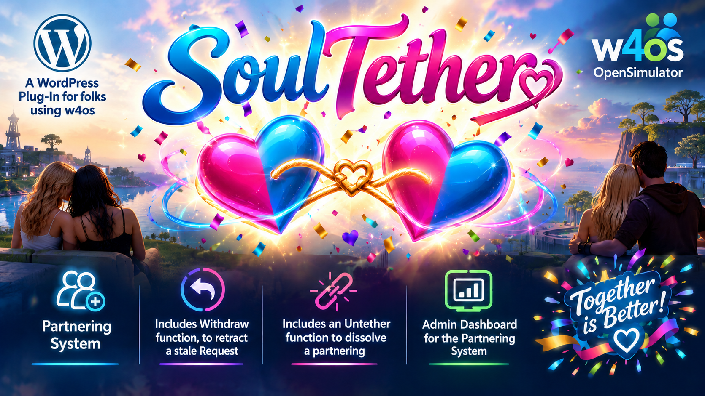

# 💕 SoulTether — OpenSim Partner System for WordPress



**SoulTether** is a WordPress plugin that brings a fully-featured avatar partnership system to OpenSimulator grids. Residents can send, accept, decline, withdraw, and untether partnerships directly from your WordPress site — with changes syncing live to the OpenSim Robust database and appearing on in-world profiles.

[](https://www.gnu.org/licenses/gpl-2.0)
[](https://github.com/mteedev/soultether/releases)

---

## ✨ Features

- 💌 **Send tether requests** — with optional personal message
- ✅ **Accept or Decline** incoming requests
- ↩️ **Withdraw** outgoing pending requests
- 💔 **Untether** active partnerships
- ❤️ **Live sync** to OpenSim Robust database (`userprofile.profilePartner`)
- 👥 **Friend list** pulled live from Robust DB (`Friends` table)
- 📬 **Email notifications** to the request recipient
- 🛡️ **Security** — self-partner prevention, ownership validation, nonce protection
- 🗂️ **Admin panel** — view all requests with status filters and pagination
- 📱 **Responsive** — works on mobile and desktop

---

## ⚙️ Requirements

- WordPress 6.0+
- PHP 8.0+
- [w4os — WordPress for OpenSimulator](https://wordpress.org/plugins/w4os/) plugin
- Direct MySQL access to your OpenSim Robust database
- OpenSimulator grid with standard `userprofile`, `UserAccounts`, and `Friends` tables

---

## 🚀 Installation

1. Download the latest release zip from [Releases](https://github.com/mteedev/soultether/releases)
2. In WordPress Admin → Plugins → Add New → Upload Plugin
3. Upload the zip and activate
4. **Configure your Robust DB credentials** in `soultether.php` (see Configuration below)
5. Create a WordPress page and add the shortcode `[soultether]`
6. Add the page to your navigation menu

---

## 🔧 Configuration

**SoulTether is zero-config if you have w4os installed!**

SoulTether automatically reads your Robust DB credentials from w4os settings — no manual configuration needed. Just install, activate, add the shortcode, and go.

### Optional Overrides

If you need to override the w4os credentials (e.g. a different DB user for SoulTether), define these in `wp-config.php`:

```php
// Override w4os Robust DB credentials
define( 'SOULTETHER_ROBUST_HOST',   '127.0.0.1' );
define( 'SOULTETHER_ROBUST_PORT',   '3306' );
define( 'SOULTETHER_ROBUST_DB',     'robust' );
define( 'SOULTETHER_ROBUST_USER',   'osadmin' );
define( 'SOULTETHER_ROBUST_PASS',   'your_password' );

// Optional: Unix socket for faster local connections
define( 'SOULTETHER_ROBUST_SOCKET', '/run/mysqld/mysqld.sock' );
```

---

## 📋 Database Schema Compatibility

SoulTether is built against the standard OpenSimulator Robust database schema:

| Table | Columns Used |
|---|---|
| `UserAccounts` | `PrincipalID`, `FirstName`, `LastName` |
| `userprofile` | `useruuid` (PK), `profilePartner` |
| `Friends` | `PrincipalID`, `Friend` |

If your grid uses different column names, adjust the queries in `includes/class-robust-db.php`.

---

## 🎯 Shortcode

Place this shortcode on any WordPress page:

```
[soultether]
```

---

## 📁 File Structure

```
soultether/
├── soultether.php              ← Main plugin file
├── includes/
│   ├── class-robust-db.php     ← Robust DB connection & queries
│   ├── class-partner-db.php    ← WordPress request tracking table
│   ├── class-partner-core.php  ← Business logic
│   └── helpers.php             ← Template utilities
├── templates/
│   ├── dashboard.php           ← Main shortcode view
│   ├── admin-panel.php         ← WP Admin panel
│   ├── not-logged-in.php       ← Guest view
│   └── no-avatar.php           ← No avatar linked view
└── assets/
    ├── soultether.css          ← Frontend styles
    └── soultether.js           ← AJAX interactions
```

---

## 🔄 Changelog

See [CHANGELOG.md](CHANGELOG.md)

---

## 👤 Author

**Gundahar Bravin**
[nerdypappy.com](https://nerdypappy.com)
GitHub: [@mteedev](https://github.com/mteedev)

---

## 📜 License

GPL-2.0 — see [LICENSE](LICENSE) for details.

This plugin was built for [Neverworld Grid](https://neverworldgrid.com) and released to the OpenSim community.
